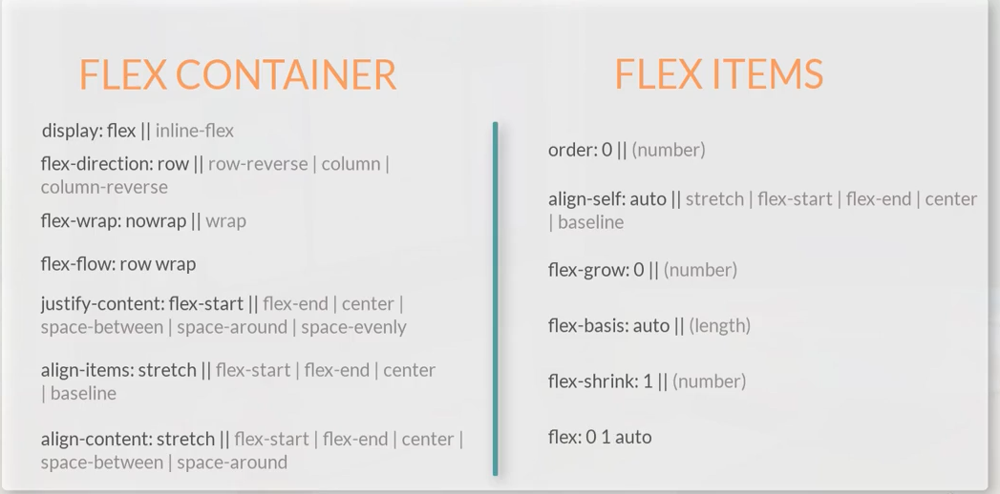
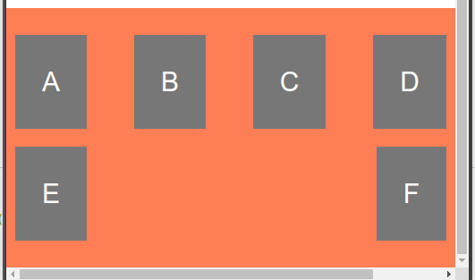
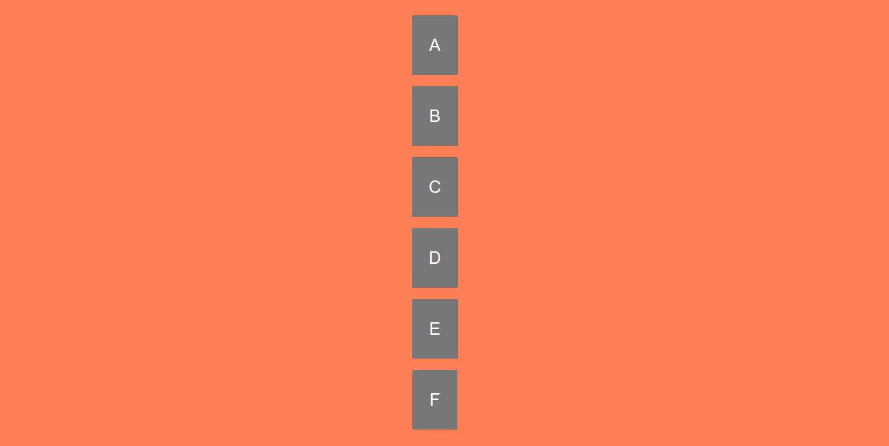

# Bootstrap  


## Intro
Starter template: https://getbootstrap.com/docs/4.0/getting-started/introduction/#starter-template

### Fonts
https://getbootstrap.com/docs/4.0/utilities/text/

### Breakpoints

`xs < 576 <= sm < 768 <= md < 992 <= lg < 1200 <= xl` [In pixels] <br />
If sm is specified then that class will work at >= sm devices. <br />
Example: <br />
```
    <p class="text-sm-center">This is some text that is centered on >= sm devices</p>

```

### Marging and padding
https://getbootstrap.com/docs/4.0/utilities/spacing/ <br />
Formating:  `{property}{sides}-{size}` or `{property}{sides}-{breakpoint}-{size}` <br />
Margin: `mb-0` means margin-bottom = 0

### Floating and spacing
https://getbootstrap.com/docs/4.0/utilities/float/

### Flexbox


Resources: https://css-tricks.com/snippets/css/a-guide-to-flexbox/ <br />
Input:
```
<style>
      .container-fluid {
        margin-top: 50px;
        padding: 20px 0;
        background-color: coral;
        display: flex;
        /* flex-direction: row; */
        /* flex-wrap: wrap; */
        flex-flow: row wrap;
        justify-content: center;
        justify-content: space-between;
      }

      .item {
        padding: 30px;
        margin: 10px;
        background-color: #777;
        text-align: center;
        font-size: 30px;
        color: white;
      }
</style>

 <div class="container-fluid">
      <div class="item item1">A</div>
      <div class="item item2">B</div>
      <div class="item item3">C</div>
      <div class="item item4">D</div>
      <div class="item item5">E</div>
      <div class="item item6">F</div>
</div>
```
Output:
 <br />

Input:
```
 <style>
      .container-fluid {
        margin-top: 50px;
        padding: 20px 0;
        background-color: coral;
        display: flex;
        /* flex-direction: row; */
        /* flex-wrap: wrap; */
        flex-flow: column wrap;
        justify-content: center;
        justify-content: space-around;
        align-items: center;
      }


      .item {
        padding: 30px;
        margin: 10px;
        background-color: #777;
        text-align: center;
        font-size: 30px;
        color: white;
      }
    </style>
      <div class="container-fluid">
      <div class="item item1">A</div>
      <div class="item item2">B</div>
      <div class="item item3">C</div>
      <div class="item item4">D</div>
      <div class="item item5">E</div>
      <div class="item item6">F</div>
    </div>
```
Output:
 <br />

